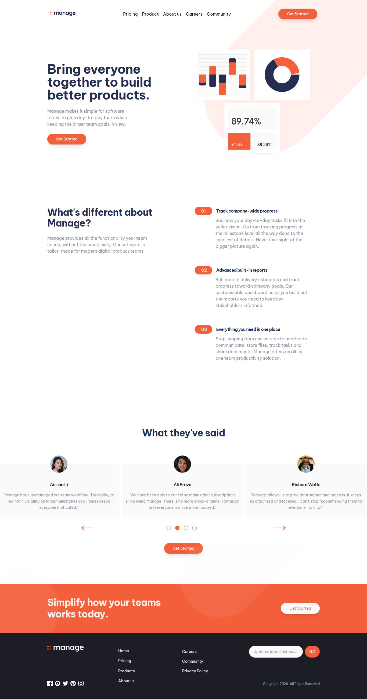

## Table of contents

- [Table of contents](#table-of-contents)
- [Overview](#overview)
  - [Screenshot](#screenshot)
- [My process](#my-process)
  - [Built with](#built-with)
  - [What I learned](#what-i-learned)
- [Author](#author)

**Note: Delete this note and update the table of contents based on what sections you keep.**

## Overview

### Screenshot

- Solution URL: (https://github.com/AlMubaraq7/manage)
- Live Site URL: (https://manage-orpin-one.vercel.app/)

## My process

### Built with

- Semantic HTML5 markup
- Flexbox
- CSS Grid
- Desktop-first workflow
- [React](https://reactjs.org/) - JS library
- [Tailwind](https://tailwindcss.com/) - CSS Framework

### What I learned

Learned how to use tailwind!

## Author

<!-- - Website - [Add your name here](https://www.your-site.com) -->

- Frontend Mentor - [@yourusername](https://www.frontendmentor.io/profile/AlMubaraq7)
- Twitter - [@yourusername](https://www.x.com/mubaraq_sama)
